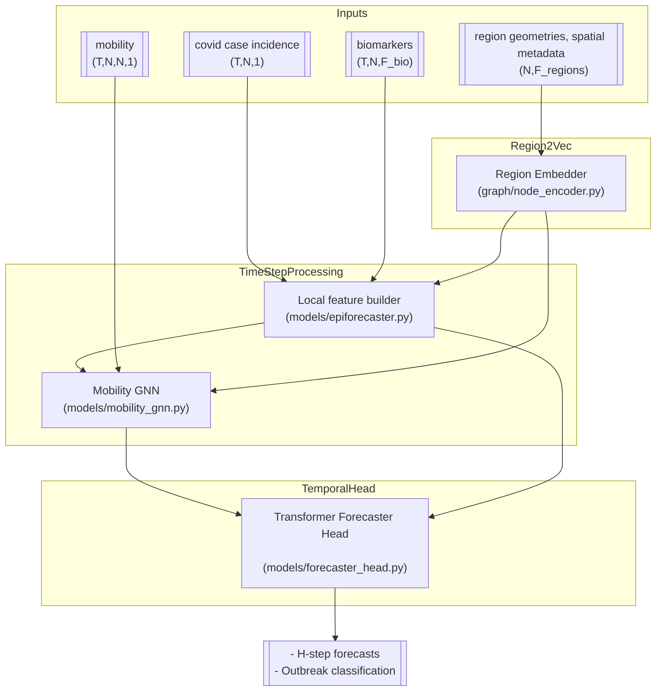

# Dual Graph Neural Network for Epidemiological Forecasting

A PyTorch Geometric implementation for epidemiological forecasting which combines mobility flow networks with wastewater treatment plant (EDAR) surveillance signals for enhanced disease prediction.

For information on the forecaster model design see EPIFORECASTER.md
For information on the region embedding model design see REGION2VEC.md

## Model Architecture

The `EpiForecaster` assembly in `models/epiforecaster.py` orchestrates three cooperating modules: the inductive region embedder defined in `graph/node_encoder.py`, the per-time-step mobility GNN in `models/mobility_gnn.py`, and the Transformer forecasting head in `models/forecaster_head.py`. The diagram below shows how static, mobility, and temporal signals move through the complete model.



## Installation

```bash
# Using uv (recommended for this project)
uv sync

# Install development dependencies
uv sync --group dev

# Or manually install with pip
pip install -e .
```

The installation provides access to the `epiforecaster` command-line interface:
- After `pip install -e .`: Use `epiforecaster` directly
- With `uv`: Use `uv run python -m cli` (recommended for development)

## Usage

EpiForecaster follows a two-step workflow: data preprocessing followed by model training. All operations are managed through the `epiforecaster` CLI with YAML configuration files.

### Quick Start

```bash
uv run python -m cli preprocess epiforecaster --config preprocess_config.yaml

uv run python -m cli train epiforecaster --config train_config.yaml
```

### Dataset Management

```bash
# List available preprocessed datasets
uv run python -m cli list-datasets --data-dir data/processed

# Get detailed information about a dataset
uv run python -m cli info --dataset data/processed/dataset.zarr --validate
```

## References

[1] Hamilton, W., Ying, Z., & Leskovec, J. (2017). **Inductive Representation Learning on Large Graphs**. *Advances in Neural Information Processing Systems (NeurIPS)*, 30. [arXiv:1706.02216](https://arxiv.org/abs/1706.02216)

[2] Li, Y., et al. (2024). **Learning Geospatial Region Embedding with Heterogeneous Graph**. *ACM Transactions on Knowledge Discovery from Data*, 18(5), 1-23. [doi:10.1145/3643035](https://doi.org/10.1145/3643035)

[3] Kipf, T. N., & Welling, M. (2017). **Semi-Supervised Classification with Graph Convolutional Networks**. *International Conference on Learning Representations (ICLR)*. [arXiv:1609.02907](https://arxiv.org/abs/1609.02907)

[4] Fey, M., & Lenssen, J. E. (2019). **Fast Graph Representation Learning with PyTorch Geometric**. *ICLR Workshop on Representation Learning on Graphs and Manifolds*. [arXiv:1903.02428](https://arxiv.org/abs/1903.02428)

[5] Zhang, J., et al. (2023). **Heterogeneous Graph Neural Networks for Origin-Destination Demand Prediction**. *Transportation Research Part C*, 147, 103995. [doi:10.1016/j.trc.2022.103995](https://doi.org/10.1016/j.trc.2022.103995)

## License

MIT License

## Contributing

Contributions are welcome! Please see CONTRIBUTING.md for guidelines.

## Contact

For questions and support, please open an issue on GitHub.
