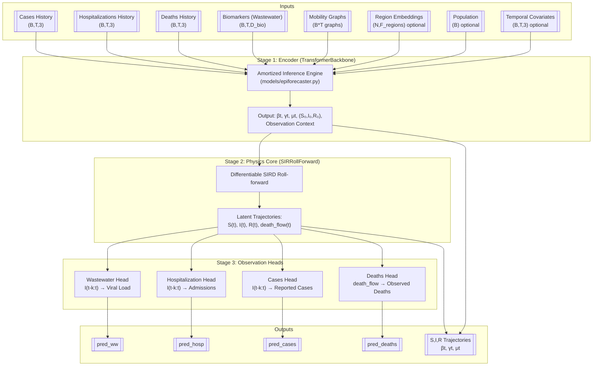

# Dual Graph Neural Network for Epidemiological Forecasting

A PyTorch Geometric implementation for epidemiological forecasting which combines mobility flow networks with wastewater treatment plant (EDAR) surveillance signals for enhanced disease prediction.

For information on the forecaster model design see EPIFORECASTER.md
For information on the region embedding model design see REGION2VEC.md

## Model Architecture

The `EpiForecaster` implements a **Joint Inference-Observation** framework with a three-stage differentiable pipeline. See [EPIFORECASTER.md](EPIFORECASTER.md) for full details.


```mermaid
flowchart TD
    subgraph Inputs
        cases_hist[["Cases History
        (B,T,3)"]]
        hosp_hist[["Hospitalizations History
        (B,T,3)"]]
        deaths_hist[["Deaths History
        (B,T,3)"]]
        biomarkers[["Biomarkers (Wastewater)
        (B,T,D_bio)"]]
        mobility[["Mobility Graphs
        (B*T graphs)"]]
        regions[["Region Embeddings
        (N,F_regions) optional"]]
        population[["Population
        (B) optional"]]
        temporal[["Temporal Covariates
        (B,T,3) optional"]]
    end

    subgraph Stage1_Encoder["Stage 1: Encoder (TransformerBackbone)"]
        encoder["Amortized Inference Engine
(models/epiforecaster.py)"]
        rates["Output: βt, γt, μt, (S₀,I₀,R₀),
Observation Context"]
    end

    subgraph Stage2_Physics["Stage 2: Physics Core (SIRRollForward)"]
        sir["Differentiable SIRD Roll-forward"]
        latent["Latent Trajectories:
S(t), I(t), R(t), death_flow(t)"]
    end

    subgraph Stage3_Observation["Stage 3: Observation Heads"]
        ww_head["Wastewater Head
I(t-k:t) → Viral Load"]
        hosp_head["Hospitalization Head
I(t-k:t) → Admissions"]
        cases_head["Cases Head
I(t-k:t) → Reported Cases"]
        deaths_head["Deaths Head
death_flow → Observed Deaths"]
    end

    subgraph Outputs
        pred_ww[["pred_ww"]]
        pred_hosp[["pred_hosp"]]
        pred_cases[["pred_cases"]]
        pred_deaths[["pred_deaths"]]
        latent_out[["S,I,R Trajectories
βt, γt, μt"]]
    end

    cases_hist --> encoder
    hosp_hist --> encoder
    deaths_hist --> encoder
    biomarkers --> encoder
    mobility --> encoder
    regions --> encoder
    population --> encoder
    temporal --> encoder

    encoder --> rates --> sir
    sir --> latent

    latent --> ww_head --> pred_ww
    latent --> hosp_head --> pred_hosp
    latent --> cases_head --> pred_cases
    latent --> deaths_head --> pred_deaths

    rates --> latent_out
    latent --> latent_out
```

**Key Design Principles:**
- **Physics constrains the Latent State**: SIRD dynamics enforce epidemiological consistency
- **Observations constrain the Physics**: Multiple observation heads anchor latent states to real-world signals
- **End-to-end Differentiable**: All three stages are jointly optimized via composite loss

## Installation

```bash
# Using uv (recommended for this project)
uv sync

# Install development dependencies
uv sync --group dev

# Or manually install with pip
pip install -e .
```

The installation provides access to the `epiforecaster` command-line interface:

## Usage

EpiForecaster follows a two-step workflow: data preprocessing followed by model training. All operations are managed through the `epiforecaster` CLI with YAML configuration files.

### Quick Start

```bash
# Step 1: Preprocess data
uv run preprocess epiforecaster --config preprocess_config.yaml

# Step 2: Train model
uv run train epiforecaster --config train_config.yaml

# Step 3: Evaluate checkpoint and generate plots
uv run eval epiforecaster --experiment <name> --run <run_id> --split val

# Step 4: (Optional) Generate custom forecast plots
uv run plot forecasts --experiment <name> --run <run_id> --nodes quartile:3
```

### CLI Commands

All commands can be run via their standalone entrypoints or through the main CLI:

| Standalone | Via main | Description |
|------------|----------|-------------|
| `uv run preprocess` | `uv run main preprocess` | Run preprocessing pipelines |
| `uv run train` | `uv run main train` | Train forecasting models |
| `uv run eval` | `uv run main eval` | Evaluate checkpoints and compute metrics |
| `uv run plot` | `uv run main plot` | Generate forecast visualization plots |

**Evaluation commands:**
- `eval epiforecaster`: Evaluate checkpoint, compute metrics, generate quartile-based plots
- `eval baselines`: Run rolling-origin baseline benchmarks (tiered, exp_smoothing, var_cross_target)

**Plotting commands:**
- `plot forecasts`: Generate forecast plots with flexible node selection (random, quartile, best, worst)

### Development & Testing

```bash
# Run all tests
uv run pytest tests/

# Run tests with specific markers
uv run pytest -m region -v              # Region-related tests only
uv run pytest -m epiforecaster -v        # EpiForecaster tests only
uv run pytest -m "not region" -v         # All tests except region

# Linting and formatting
uv run ruff check .
uv run ruff format .
```

Tests are organized with pytest markers:

- `@pytest.mark.region`: Tests for region2vec, region losses, spatial autocorrelation
- `@pytest.mark.epiforecaster`: Tests for the main epidemiological forecaster model

Run `uv run pytest --markers` to see all available markers.

## References

[1] Hamilton, W., Ying, Z., & Leskovec, J. (2017). **Inductive Representation Learning on Large Graphs**. *Advances in Neural Information Processing Systems (NeurIPS)*, 30. [arXiv:1706.02216](https://arxiv.org/abs/1706.02216)

[2] Li, Y., et al. (2024). **Learning Geospatial Region Embedding with Heterogeneous Graph**. *ACM Transactions on Knowledge Discovery from Data*, 18(5), 1-23. [doi:10.1145/3643035](https://doi.org/10.1145/3643035)

[3] Kipf, T. N., & Welling, M. (2017). **Semi-Supervised Classification with Graph Convolutional Networks**. *International Conference on Learning Representations (ICLR)*. [arXiv:1609.02907](https://arxiv.org/abs/1609.02907)

[4] Fey, M., & Lenssen, J. E. (2019). **Fast Graph Representation Learning with PyTorch Geometric**. *ICLR Workshop on Representation Learning on Graphs and Manifolds*. [arXiv:1903.02428](https://arxiv.org/abs/1903.02428)

[5] Zhang, J., et al. (2023). **Heterogeneous Graph Neural Networks for Origin-Destination Demand Prediction**. *Transportation Research Part C*, 147, 103995. [doi:10.1016/j.trc.2022.103995](https://doi.org/10.1016/j.trc.2022.103995)
[6] Liang, Y., et al. (2022) Region2Vec: community detection on spatial networks using graph embedding with node attributes and spatial interactions. *Proceedings of the 30th International Conference on Advances in Geographic Information Systems (pp. 1-4)* [doi.org/10.1145/3557915.3560974](https://doi.org/10.1145/3557915.3560974)

## License

MIT License

## Contributing

Contributions are welcome! Please see CONTRIBUTING.md for guidelines.

## Contact

For questions and support, please open an issue on GitHub.
